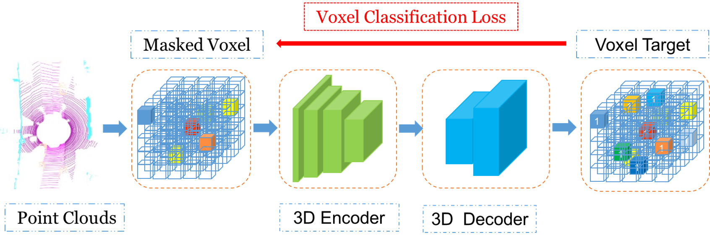

# Occupancy-MAE: Self-supervised Pre-training Large-scale LiDAR Point Clouds with Masked Occupancy Autoencoders

Repository for our arxiv paper ["Occupancy-MAE: Self-supervised Pre-training Large-scale LiDAR Point Clouds with Masked Occupancy Autoencoders"](https://arxiv.org/abs/2206.09900).

## Introduction
Mask-based pre-training has achieved great success for self-supervised learning in images and languages without manually annotated supervision. However, it has not yet been studied for large-scale point clouds with redundant spatial information. In this research, we propose a mask voxel autoencoder network for pre-training large-scale point clouds, dubbed Voxel-MAE. Our key idea is to transform the point clouds into voxel representations and classify whether the voxel contains point clouds. This simple but effective strategy makes the network voxel-aware of the object shape, thus improving the performance of downstream tasks, such as 3D object detection. Our Voxel-MAE, with even a 90\% masking ratio, can still learn representative features for the high spatial redundancy of large-scale point clouds. We also validate the effectiveness of Voxel-MAE on unsupervised domain adaptative tasks, which proves the generalization ability of Voxel-MAE. Our Voxel-MAE proves that it is feasible to pre-train large-scale point clouds without data annotations to enhance the perception ability of the autonomous vehicle. Extensive experiments show great effectiveness of our pre-training method with 3D object detectors (SECOND, CenterPoint, and PV-RCNN) on three popular datasets (KITTI, Waymo, and nuScenes).

<p align="center">
Flowchart of Voxel-MAE
</p>

## Installation

Please refer to [INSTALL.md](docs/INSTALL.md) for the installation of [OpenPCDet(v0.5)](https://github.com/open-mmlab/OpenPCDet).

## Getting Started

Please refer to [GETTING_STARTED.md](docs/GETTING_STARTED.md) .

## Usage

### First Pre-training Voxel-MAE

KITTI:

```
Train with multiple GPUs:
bash ./scripts/dist_train_voxel_mae.sh ${NUM_GPUS}  --cfg_file cfgs/kitti_models/voxel_mae_kitti.yaml --batch_size ${BATCH_SIZE}

Train with a single GPU:
python3 train_voxel_mae.py  --cfg_file cfgs/kitti_models/voxel_mae_kitti.yaml --batch_size ${BATCH_SIZE}
```

Waymo:

```
python3 train_voxel_mae.py  --cfg_file cfgs/kitti_models/voxel_mae_waymo.yaml --batch_size ${BATCH_SIZE}
```

nuScenes:

```
python3 train_voxel_mae.py  --cfg_file cfgs/kitti_models/voxel_mae_nuscenes.yaml --batch_size ${BATCH_SIZE}
```

### Then traing OpenPCDet

Same as [OpenPCDet](https://github.com/open-mmlab/OpenPCDet) with pre-trained model from our Voxel-MAE.
```
bash ./scripts/dist_train.sh ${NUM_GPUS}  --cfg_file cfgs/kitti_models/second.yaml --batch_size ${BATCH_SIZE} --pretrained_model ../output/kitti/voxel_mae/ckpt/check_point_10.pth
```

## Performance

### KITTI Dataset

The results are the 3D detection performance of moderate difficulty on the *val* set of KITTI dataset. Results of OpenPCDet are from [here](https://github.com/open-mmlab/OpenPCDet) .

|                                                       |  Car@R11  | Pedestrian@R11 | Cyclist@R11 | 
| ----------------------------------------------------- | :-------: | :------------: | :---------: | 
| [SECOND](tools/cfgs/kitti_models/second.yaml)         |   78.62   |     52.98      |    67.15    | 
| Voxel-MAE+SECOND                                      | **78.90** |   **53.14**    |  **68.08**  | 
| [SECOND-IoU](tools/cfgs/kitti_models/second_iou.yaml) |   79.09   |     55.74      |    71.31    | 
| Voxel-MAE+SECOND-IoU                                  | **79.22** |   **55.79**    |  **72.22**  | 
| [PV-RCNN](tools/cfgs/kitti_models/pv_rcnn.yaml)       |   83.61   |     57.90      |    70.47    |
| Voxel-MAE+PV-RCNN                                     | **83.82** |   **59.37**    |  **71.99**  | 

### Waymo Open Dataset

Similar to  [OpenPCDet](https://github.com/open-mmlab/OpenPCDet) , all models are trained with **a single frame** of **20% data (~32k frames)** of all the training samples , and the results of each cell here are mAP/mAPH calculated by the official Waymo evaluation metrics on the **whole** validation set (version 1.2).    

| Performance@(train with 20\% Data)                           |              Vec_L1 |       Vec_L2        |       Ped_L1        |       Ped_L2        |       Cyc_L1        |       Cyc_L2        | Voxel-MAE                                                    |                         3D Detection                         |
| ------------------------------------------------------------ | ------------------: | :-----------------: | :-----------------: | :-----------------: | :-----------------: | :-----------------: | ------------------------------------------------------------ | :----------------------------------------------------------: |
| [SECOND](tools/cfgs/waymo_models/second.yaml)                |         70.96/70.34 |     62.58/62.02     |     65.23/54.24     |     57.22/47.49     |     57.13/55.62     |     54.97/53.53     |                                                              |                                                              |
| Voxel-MAE+SECOND                                             | **71.12**/**70.58** | **62.67**/**62.34** | **67.21**/**55.68** | **59.03**/**48.79** | **57.73**/**56.18** | **55.62**/**54.17** | | |
| [CenterPoint](tools/cfgs/waymo_models/centerpoint_without_resnet.yaml) |         71.33/70.76 |     63.16/62.65     |     72.09/65.49     |     64.27/58.23     |     68.68/67.39     |     66.11/64.87     |                                                              |                                                              |
| Voxel-MAE+CenterPoint                                        | **71.89**/**71.33** | **64.05**/**63.53** | **73.85**/**67.12** | **65.78**/**59.62** | **70.29**/**69.03** | **67.76**/**66.53** |  | |
| [PV-RCNN (AnchorHead)](tools/cfgs/waymo_models/pv_rcnn.yaml) |         75.41/74.74 |     67.44/66.80     |     71.98/61.24     |     63.70/53.95     |     65.88/64.25     |     63.39/61.82     |                                                              |                                                              |
| Voxel-MAE+PV-RCNN (AnchorHead                                | **75.94**/**75.28** | **67.94**/**67.34** | **74.02**/**63.48** | **64.91**/**55.57** | **67.21**/**65.49** | **64.62**/**63.02** | |      |
| [PV-RCNN (CenterHead)](tools/cfgs/waymo_models/pv_rcnn_with_centerhead_rpn.yaml) |         75.95/75.43 |     68.02/67.54     |     75.94/69.40     |     67.66/61.62     |     70.18/68.98     |     67.73/66.57     |                                                              |                                                              |
| Voxel-MAE+PV-RCNN (CenterHead)                               | **77.29**/**76.81** | **68.71**/**68.21** | **77.70**/**71.13** | **69.53**/**63.46** | **70.55**/**69.39** | **68.11**/**66.95** |  | |
| [PV-RCNN++](tools/cfgs/waymo_models/pv_rcnn_plusplus.yaml)   |         77.82/77.32 |     69.07/68.62     |     77.99/71.36     |     69.92/63.74     |     71.80/70.71     |     69.31/68.26     |                                                              |                                                              |
| Voxel-MAE+PV-RCNN++                                          | **78.23**/**77.72** | **69.54**/**69.12** | **79.85**/**73.23** | **71.07**/**64.96** |     71.80/70.64     |     69.31/68.26     ||  |

### nuScenes Dataset 

|                                                              |       mAP |       NDS |   mATE    |   mASE    |   mAOE    |   mAVE    |   mAAE    | 
| ------------------------------------------------------------ | --------: | --------: | :-------: | :-------: | :-------: | :-------: | :-------: | 
| [SECOND-MultiHead (CBGS)](tools/cfgs/nuscenes_models/cbgs_second_multihead.yaml) |     50.59 |     62.29 |   31.15   |   25.51   |   26.64   |   26.26   |   20.46   |
| Voxel-MAE+SECOND-MultiHead                                   | **50.82** | **62.45** | **31.02** | **25.23** | **26.12** | **26.11** | **20.04** | 
| [CenterPoint (voxel_size=0.1)](tools/cfgs/nuscenes_models/cbgs_voxel01_res3d_centerpoint.yaml) |     56.03 |     64.54 |   30.11   |   25.55   |   38.28   |   21.94   |   18.87   | 
| Voxel-MAE+CenterPoint                                        | **56.45** | **65.02** | **29.73** | **25.17** | **38.38** | **21.47** | **18.65** |  


##  License
Our codes are released under the Apache 2.0 license.

## Acknowledgement

This repository is based on [OpenPCDet](https://github.com/open-mmlab/OpenPCDet).


## Citation 
If you find this project useful in your research, please consider cite:


```
@ARTICLE{Occupancy-MAE,
    title={Voxel-MAE: Masked Autoencoders for Pre-training Large-scale Point Clouds},
    author={Chen Min, Xinli Xu, Dawei Zhao, Liang Xiao, Yiming Nie, and Bin Dai},
    journal = {arXiv e-prints},
    year={2022}
}
```

